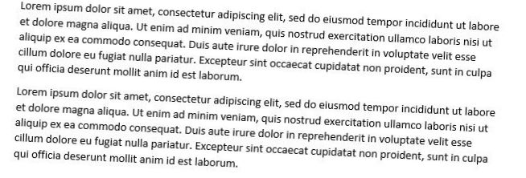

# Projection to correct image skew and identify text lines

We use a technique called 'projection' to identify document skew and location of text lines. This technique can be generalised to identify the locations of objects such as letters and boxes.

Note, that the simplest method of identifying the location of text and skew angle is by using Azure OCR. Azure OCR will provide accurate bounding boxes around lines and words, it also provides the skew angle without having to correct for skew. We provide this example as sometimes we need to process documents before an OCR step. For example, we need to remove noise from a document section before OCR. Projection is one technique that can be used to identify the location of form objects before OCR.

This [example](./skew_line_detection_projection.py) takes the following image, identifies the skew, rotates the image and then identifies the location of the text rows:

The corrected image with the mid points of the line spacing identified:

The code also identifies the location of the text lines.

# Projection to identify location of handwritten characters

This [example](./split_chars_projection.py) uses projection on the vertical axis to identify the locations of handwritten characters:

Identified mid-points between characters:

## Projection

Have a look at the [project](./) accelerator. This is a very simple technique that relies on the fact that the text is black and the backround is different colour. In this example it works in the following way:

1. Sum the pixel values in each row in the image. The result is a list of values one value for each row. If a row has no text then the sum of the pixels will be 0 (assuming inverted image).
2. Rotate the image and recalculate step 1.
3. Identify the rotation angle where the number of rows with a sum of 0 is maximised.

Back to the [Pre-Processing section](../README.md)
