# Multiple Languages

There are many services available to deal with text recognition and analysis but they don't offer the same level of support for all languages. This article details some approaches you can take when you need to work with a less-supported language or when you are dealing with a multiple language scenario where the level of support from the APIs is not consistent.

## Scenario 1: using Translator API

The [Text Analytics API](https://azure.microsoft.com/en-us/services/cognitive-services/text-analytics/) exposes [different capabilities depending on the language of the input text](https://docs.microsoft.com/en-us/azure/cognitive-services/text-analytics/language-support).

For instance, at the time of this writing, if you're trying to perform Sentiment Analysis on Czech text, you will find you cannot do it, as the API does not support it. If you already have access to the text you can use the translator API to convert it to English and then perform Sentiment Analysis. The results are not optimal as the translation may not be perfect, but it's a viable approach in some scenarios.

There are multiple approaches you can take here but we're going to use a Logic App to solve this problem: it will take a text as input, detect the language being used, compare it to a list of pre-defined languages that have limited API support and translate to English if required before performing Sentiment Analysis and returning the score.

### Prerequisite

#### Create a Text Analytics resource

A key and endpoint for a Text Analytics resource. Azure Cognitive Services are represented by Azure resources that you subscribe to. Create a resource for Text Analytics using the [Azure portal](https://docs.microsoft.com/en-us/azure/cognitive-services/cognitive-services-apis-create-account) or [Azure CLI](https://docs.microsoft.com/en-us/azure/cognitive-services/cognitive-services-apis-create-account-cli) on your local machine. You can also:

- Get a [trial key](https://azure.microsoft.com/try/cognitive-services/#lang) valid for seven days for free. After signing up, it will be available on the [Azure website](https://azure.microsoft.com/try/cognitive-services/my-apis/).
- View your resource on the [Azure portal](https://portal.azure.com/)

#### Create a Translator Text resource

Azure Cognitive Services are represented by Azure resources that you subscribe to. Create a resource for Translator Text using the [Azure portal](https://docs.microsoft.com/azure/cognitive-services/cognitive-services-apis-create-account) or [Azure CLI](https://docs.microsoft.com/azure/cognitive-services/cognitive-services-apis-create-account-cli) on your local machine. You can also:

- Get a [trial key](https://azure.microsoft.com/try/cognitive-services) valid for 7 days for free. After signing up, it will be available on the Azure website.
- View an existing resource in the [Azure portal](https://portal.azure.com/).

### Create your logic app

On the Azure Portal, create a Logic App.


Once it's ready, go to the resource. The Logic Apps Designer opens and shows a page with an introduction video and commonly used triggers. Under **Templates**, select **Blank Logic App**.


Next, we'll add a trigger for when a new HTTP Request is received. The goal is to create an endpoint for receiving some text as input.

### Create an HTTP Trigger

1. In the **Logic App Designer**, under the search box, select **All**.
2. In the search box, enter *"http request"*. From the triggers list, select this trigger: **When a HTTP request is received** 

3. Provide the following information to the trigger as shown here: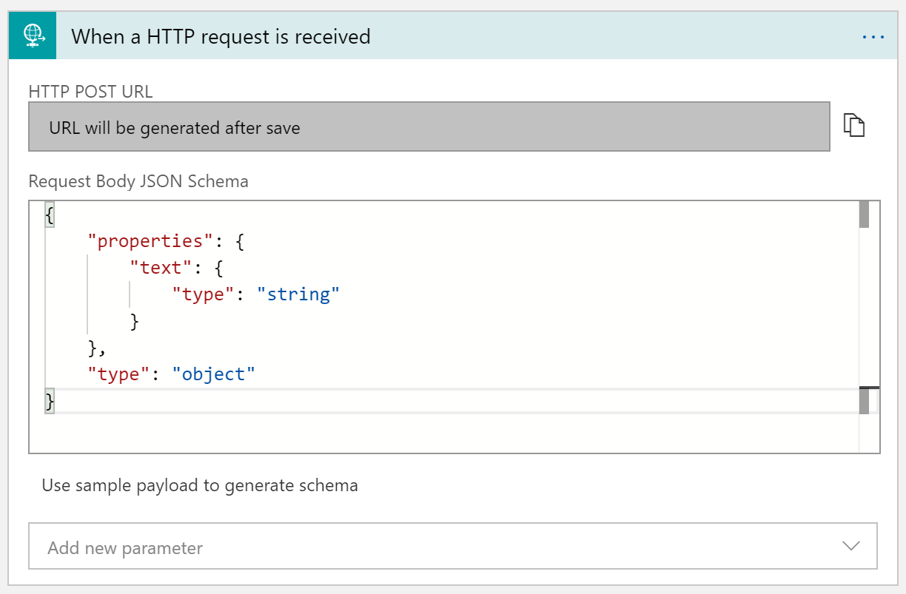

   *Schema*:

   ```json
   {
       "properties": {
           "text": {
               "type": "string"
           }
       },
       "type": "object"
   }
   ```

   This defines a HTTP endpoint that is prepared to receive a text property as a parameter. We will add steps to the Logic App to perform sentiment analysis and return the score.

3. To hide the trigger details for now, click inside the trigger's title bar. 
4. Save your logic app. On the designer toolbar, select **Save**.

### Initialize Variables

We're going to initialize two variables in our Logic App. One will hold the text on which we want to perform sentiment analysis. The second will hold a list of languages from which we want to perform translation to English.

1. Under the **When a HTTP request is received** trigger, select **New step**.


2. Under **Choose an action** and the search box, select **All**.
3. In the search box, enter *variable*. From the actions list, select the "initialize variable" action: 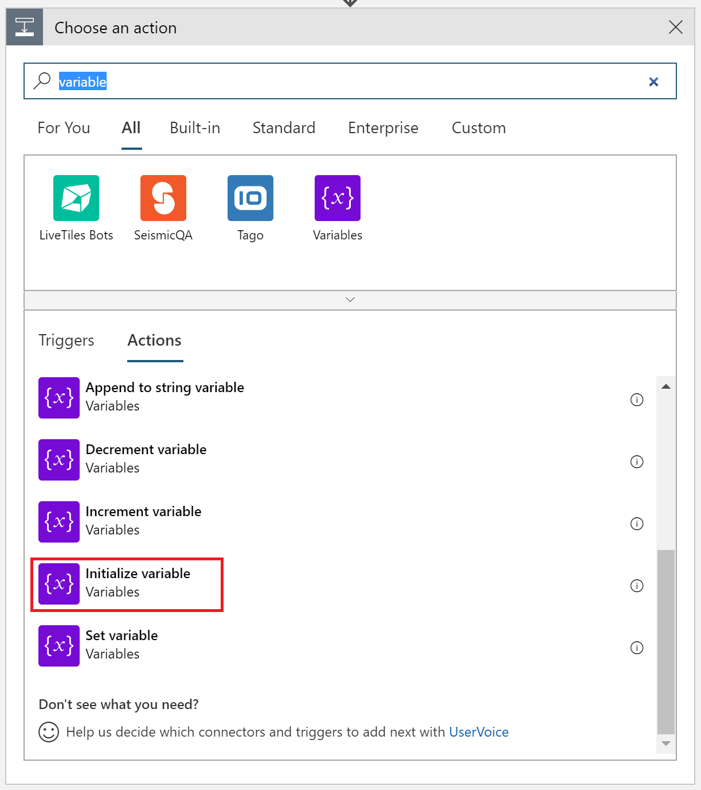

4. Fill in the required properties as follows and choose the *text* field of the HTTP trigger as the initial value: 

5. Now repeat steps 1-3 to initialize a new variable, but this time fill in the properties like this: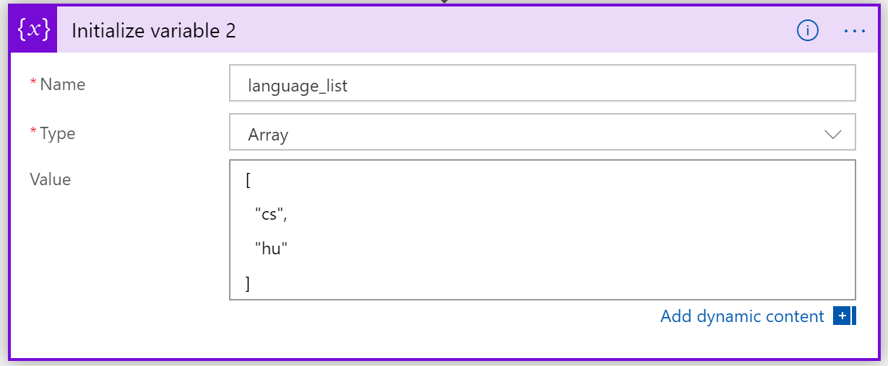
6. Save your logic app.

### Detect Language

Next we're going to call the [Text Analytics Detect Language API](https://westcentralus.dev.cognitive.microsoft.com/docs/services/TextAnalytics-v2-1/operations/56f30ceeeda5650db055a3c7) to determine the language of the incoming text. We'll use the returned value to determine if we need to perform translation prior to running the sentiment analysis.

1. Select **New step** to add an action at the end of the flow.

2. Under **Choose an action** and the search box, select **All**.
3. In the search box, enter *t*ext. Select the "Text Analytics" option:  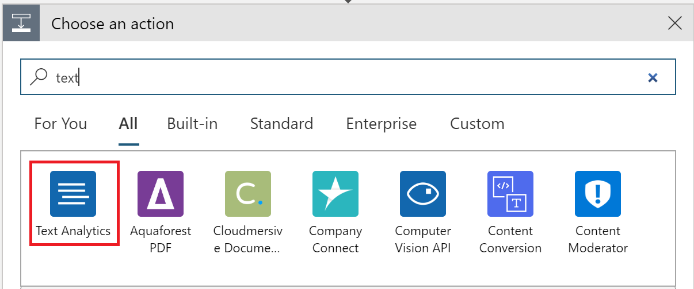

4. Select the Detect Language API: 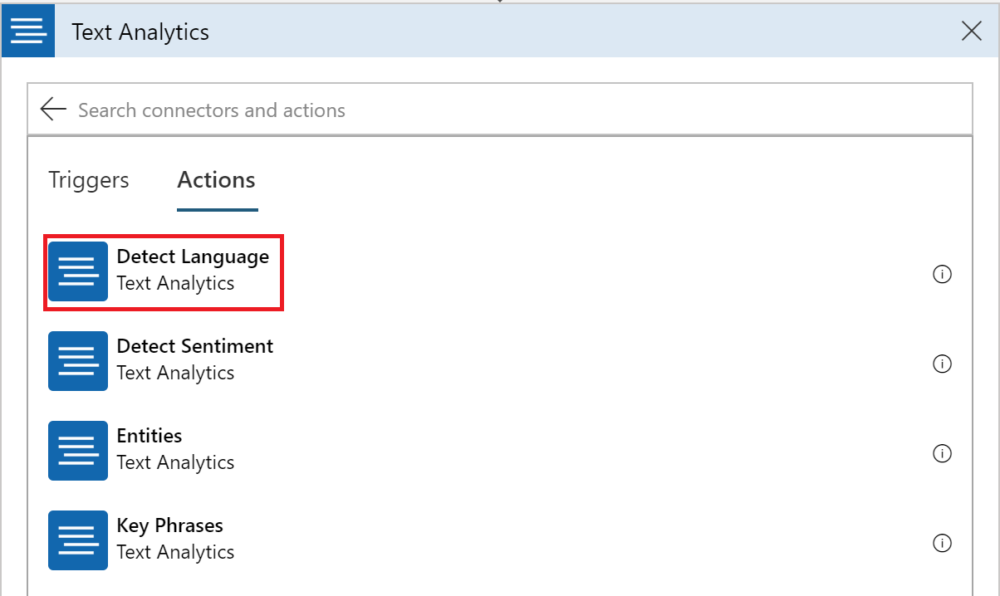

5. Fill in the properties of your Text Analytics resource: 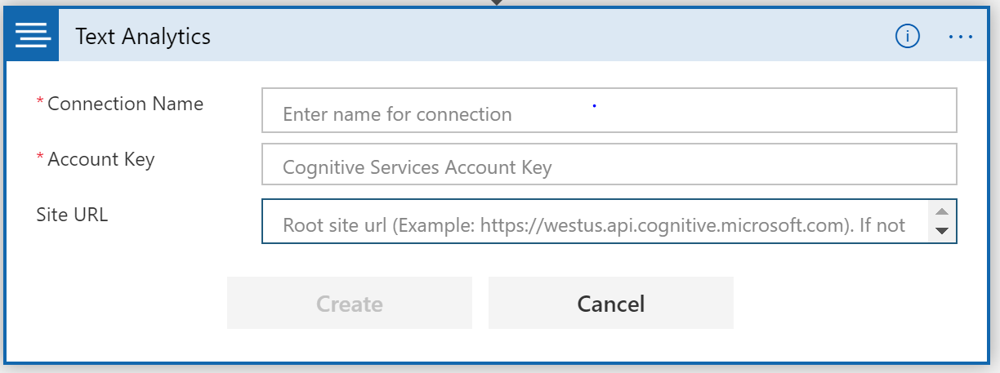

6. After configuring the connection to the Text Analytics resource, click *Add a parameter* and choose the **Text** parameter: 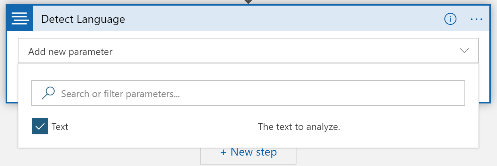

7. Assign the **text_to_analyze** variable to the parameter: 

8. Add an additional step after *Detect Language*. Choose the **Initialize Variable** action as before and initialize the properties as follows:

9. For the value, click the **Add dynamic content** option, choose **Expression** on the menu and add the following value:

   ```javascript
   first(body('Detect_Language')?['detectedLanguages'])?['iso6391Name']
   ```

   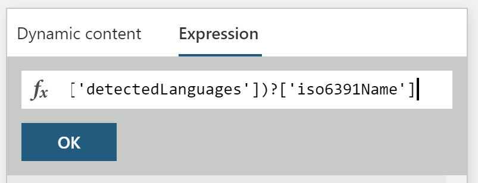The reason why we're adding this extra step is the following: the Detect Language API is prepared to receive multiple blocks of text and return an array of answers with the languages it detected on each block. Because our Logic App is only prepared to handle one block of text, we want to take just the first value returned to use in our app.

10. Verify the action looks like this and then **save** your Logic App.

### Translating the text

Now we're going to analyze the result of the Detect Language step and compare it to the list of languages for which we want to perform translation.

1. Add a new step at the end and choose the **Condition** action: 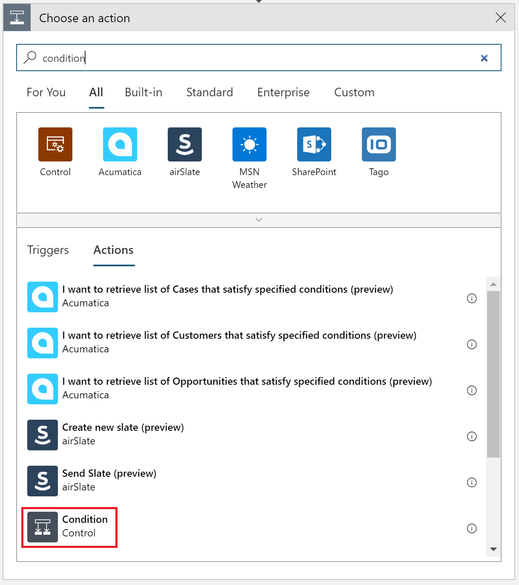

2. Specify the condition **language_list** contains **detected_language** 

3. On the **True** branch add a new action, and choose the **Translate Text **action: 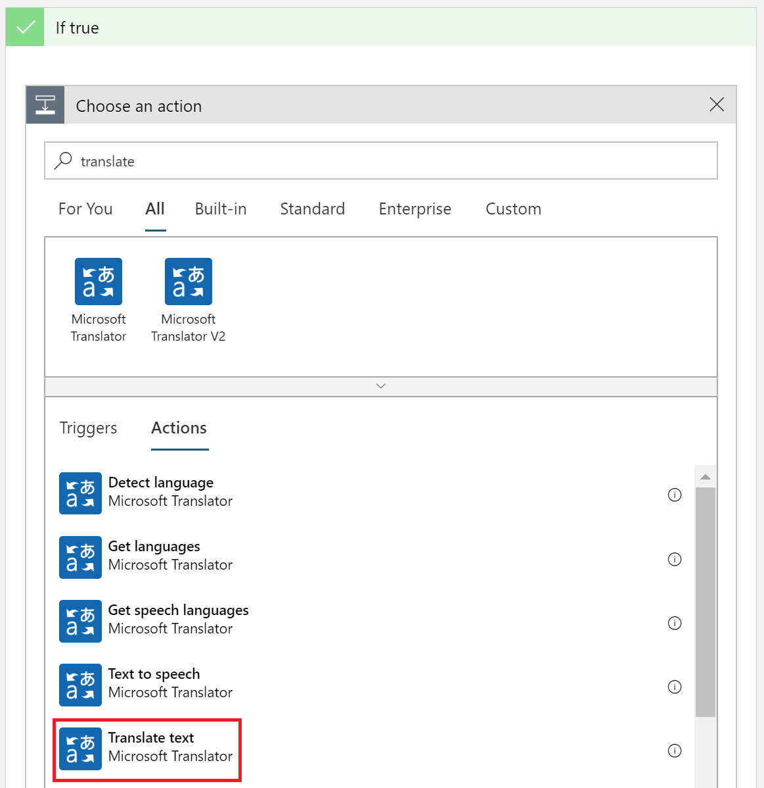

4. Configure the connection to your Translator API service then configure the action as follows: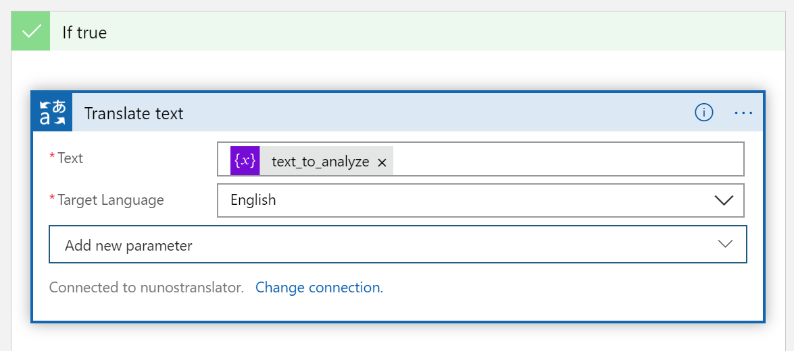

5. Add a **Set Variable** action to update the **text_to_analyze** variable with the **Translated Text** which is the result from the Translate Text action:

6. Leave the **False** branch empty and **Save** your Logic App.

### Sentiment Analysis

At this point our variable text_to_analyze either includes the original text (if in a supported language) or the translation to English otherwise. We can now perform Sentiment Detection with the Text Analytics API.

1. Add a new Step at the end of the flow (outside the condition branches), and choose the **Detect Sentiment** action: 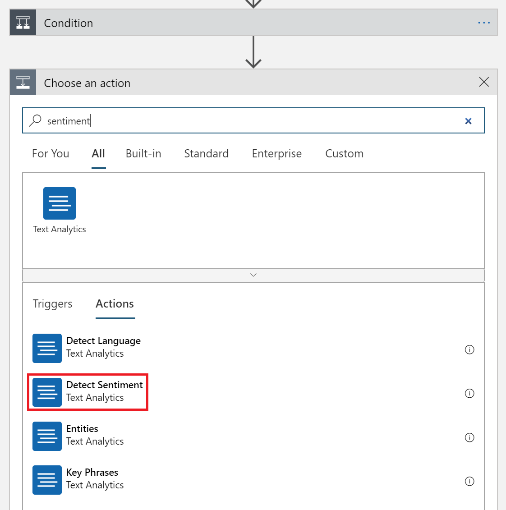

2. Add the **Text** parameter and set it to the **text_to_analyze** variable. Also add the **Language** parameter and set it to the **detected_language** variable: 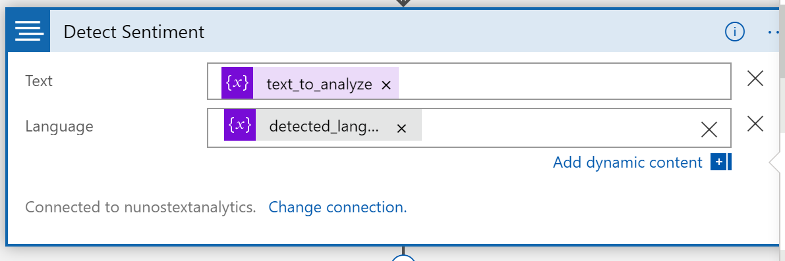

### Creating the response

Now, all we have to do is create the HTTP response for our Logic App. We're going to add a Compose action before to return both the score and the text sent to the Sentiment Analysis API so we can easily determine if the text was translated or not and verify our logic is correct.

1. Add a new step and choose the **Compose** action: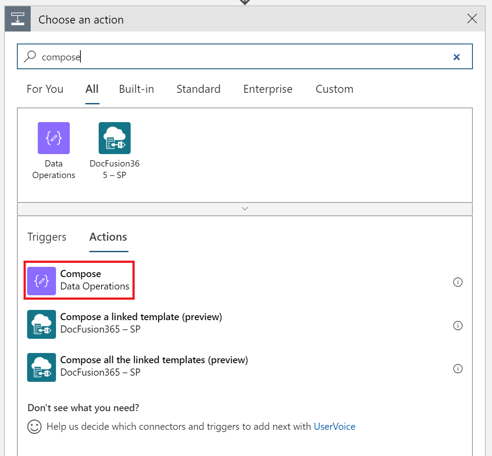

2. Configure the compose action as follows: 

3. Finally, add a **Response** action to the end of the flow: 

4. Configure it to return the **Output** of the **Compose** action: 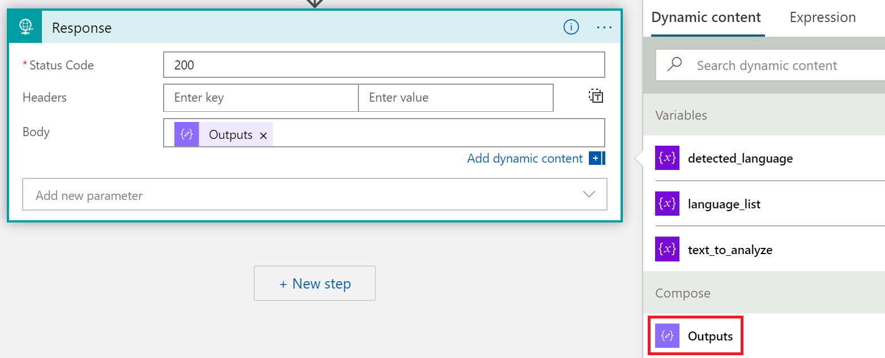

5. Save your Logic App. It's now finished!

### Running the Logic App

1. Check your Logic App looks like this: 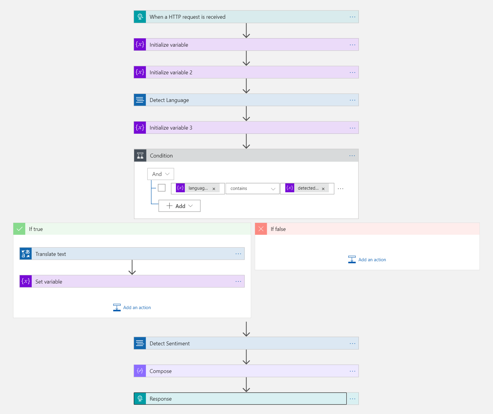

2. Click the first step (the HTTP trigger) and copy the HTTP Post URL:

3. Using [Postman](https://www.getpostman.com/), create a POST request to this URL using the following payload:

   ```json
   {
       "text": "La carretera estaba atascada. Había mucho tráfico el día de ayer."
   }
   ```

   Make sure you set the **Content-Type** header to **application/json**:

4. If all goes well, we should see the following response. Notice how the text is the original one because Spanish is not on the list of languages we want to translate from.

   ```json
   {
    "score": 0.334433376789093,
    "text": "La carretera estaba atascada. Había mucho tráfico el día de ayer."
   }
   ```

5. Now change the payload of the request to this:

   ```json
   {
       "text": "Hotel byl hrozný"
   }
   ```

6. Submit the request. You should see a response like this:

   ```json
   {
       "score": 0.0019252896308898926,
       "text": "The Hotel was terrible"
   }
   ```

   As you see the text was translated from Czech to English before attempting the sentiment analysis.

### Conclusion

We showed how a Logic App can be used to abstract the different levels of support for languages in the Text Analytics APIs. By using a single endpoint we are able to send a block of text and get the sentiment score regardless of the language used, by applying language detection and a possible translation step to prepare the data for sentiment analysis.

## Scenario 2: OCR APIs

This scenario deals with documents and images where you don't have the text yet and need to extract that information before you do any kind of analysis.

The [Computer Vision API](https://azure.microsoft.com/en-us/services/cognitive-services/computer-vision/) includes OCR capabilities to extract both printed and handwritten text from images.

At the time of this writing, the Read API only supports English but provides better results than the OCR API and is the preferred option for English language images: <https://westus.dev.cognitive.microsoft.com/docs/services/5adf991815e1060e6355ad44/operations/2afb498089f74080d7ef85eb>

The older OCR API does support multiple languages: <https://westus.dev.cognitive.microsoft.com/docs/services/5adf991815e1060e6355ad44/operations/56f91f2e778daf14a499e1fc>

### Creating a Logic App

Similarly to the first scenario, we can create a Logic App to abstract some of this complexity. This repository includes a Logic App to illustrate this scenario. Here's how it works:

1. It triggers on a blob being added or modified on an Azure Storage account
2. Fetches the contents of the file and calls the OCR API that supports more languages.
3. If the identified language is English, it calls the Read API to get a better result; if any other language it just keeps the result of the OCR API. We also check for "Unknown" as the language which usually just means the OCR API couldn't discern any text - in which case we want to try the improved Read API just in case.
4. It creates a blob with the processed OCR results

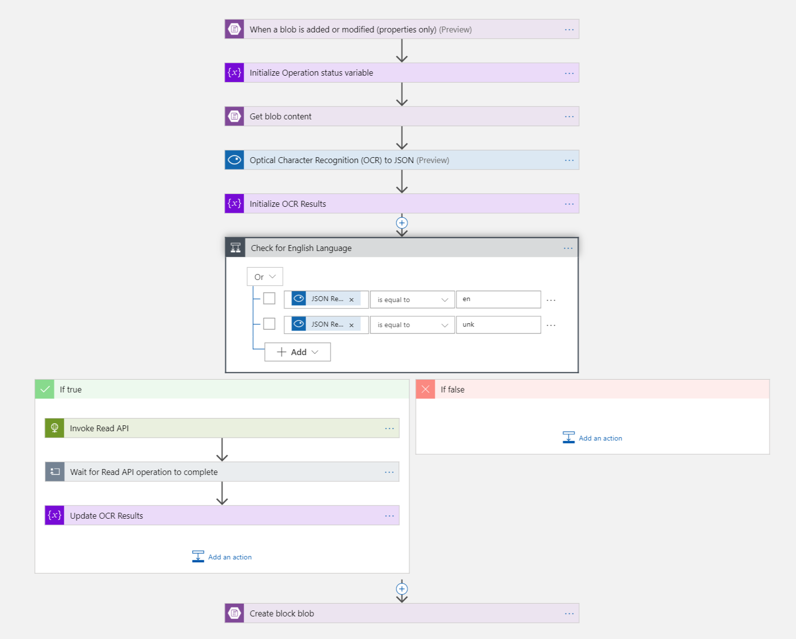

At the time of this writing, the Computer Vision connector for Logic Apps doesn't include the Read API definition so the calls are made using the HTTP action and manually filling the URL for the Computer Vision resource as well as the API key on the http headers. Furthermore, because the Read API is asynchronous, we have to apply a different technique to get the results:

1. The call is made to the Read API and we get a response, with a Operation-Location header, containing a URL to query the results.
2. We call that URL until we get a status of either "Succeeded" or "Failed" - in a Logic App this is done using the "Until" control.

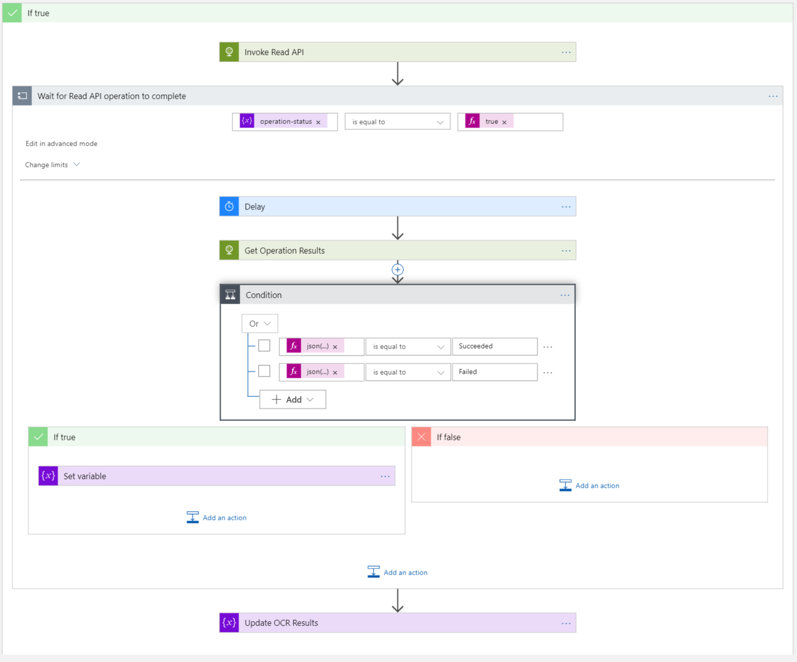

Here's the definition of the Logic App (code-view):

```json
{
    "definition": {
        "$schema": "https://schema.management.azure.com/providers/Microsoft.Logic/schemas/2016-06-01/workflowdefinition.json#",
        "actions": {
            "Check_for_English_Language": {
                "actions": {
                    "Invoke_Read_API": {
                        "inputs": {
                            "body": "@body('Get_blob_content')",
                            "headers": {
                                "Content-Type": "application/octet-stream",
                                "Ocp-Apim-Subscription-Key": "a943f87b0750499aabbd17d06e29fbc5"
                            },
                            "method": "POST",
                            "uri": "https://nunos-vision.cognitiveservices.azure.com/vision/v2.0/read/core/asyncBatchAnalyze"
                        },
                        "runAfter": {},
                        "trackedProperties": {
                            "headers": ""
                        },
                        "type": "Http"
                    },
                    "Update_OCR_Results": {
                        "inputs": {
                            "name": "ocr_results",
                            "value": "@body('Get_Operation_Results')"
                        },
                        "runAfter": {
                            "Wait_for_Read_API_operation_to_complete": [
                                "Succeeded"
                            ]
                        },
                        "type": "SetVariable"
                    },
                    "Wait_for_Read_API_operation_to_complete": {
                        "actions": {
                            "Condition": {
                                "actions": {
                                    "Set_variable": {
                                        "inputs": {
                                            "name": "operation-status",
                                            "value": "@true"
                                        },
                                        "runAfter": {},
                                        "type": "SetVariable"
                                    }
                                },
                                "expression": {
                                    "or": [
                                        {
                                            "equals": [
                                                "@json(string(body('Get_Operation_Results')))?['status']",
                                                "Succeeded"
                                            ]
                                        },
                                        {
                                            "equals": [
                                                "@json(string(body('Get_Operation_Results')))?['status']",
                                                "Failed"
                                            ]
                                        }
                                    ]
                                },
                                "runAfter": {
                                    "Get_Operation_Results": [
                                        "Succeeded"
                                    ]
                                },
                                "type": "If"
                            },
                            "Delay": {
                                "inputs": {
                                    "interval": {
                                        "count": 3,
                                        "unit": "Second"
                                    }
                                },
                                "runAfter": {},
                                "type": "Wait"
                            },
                            "Get_Operation_Results": {
                                "inputs": {
                                    "headers": {
                                        "Ocp-Apim-Subscription-Key": "a943f87b0750499aabbd17d06e29fbc5"
                                    },
                                    "method": "GET",
                                    "uri": "@{json(string(outputs('Invoke_Read_API')['headers']))?['Operation-Location']}"
                                },
                                "runAfter": {
                                    "Delay": [
                                        "Succeeded"
                                    ]
                                },
                                "type": "Http"
                            }
                        },
                        "expression": "@equals(variables('operation-status'), true)",
                        "limit": {
                            "count": 3,
                            "timeout": "PT1H"
                        },
                        "runAfter": {
                            "Invoke_Read_API": [
                                "Succeeded"
                            ]
                        },
                        "type": "Until"
                    }
                },
                "expression": {
                    "or": [
                        {
                            "equals": [
                                "@body('Optical_Character_Recognition_(OCR)_to_JSON')?['language']",
                                "en"
                            ]
                        },
                        {
                            "equals": [
                                "@body('Optical_Character_Recognition_(OCR)_to_JSON')?['language']",
                                "unk"
                            ]
                        }
                    ]
                },
                "runAfter": {
                    "Initialize_OCR_Results": [
                        "Succeeded"
                    ]
                },
                "type": "If"
            },
            "Create_block_blob": {
                "inputs": {
                    "body": "@variables('ocr_results')",
                    "host": {
                        "connection": {
                            "name": "@parameters('$connections')['azureblob']['connectionId']"
                        }
                    },
                    "method": "post",
                    "path": "/codeless/CreateBlockBlob",
                    "queries": {
                        "folderPath": "/ocr-results",
                        "name": "@{concat(triggerBody()?['Name'],'.json')}"
                    }
                },
                "runAfter": {
                    "Check_for_English_Language": [
                        "Succeeded"
                    ]
                },
                "runtimeConfiguration": {
                    "contentTransfer": {
                        "transferMode": "Chunked"
                    }
                },
                "type": "ApiConnection"
            },
            "Get_blob_content": {
                "inputs": {
                    "host": {
                        "connection": {
                            "name": "@parameters('$connections')['azureblob']['connectionId']"
                        }
                    },
                    "method": "get",
                    "path": "/datasets/default/files/@{encodeURIComponent(encodeURIComponent(triggerBody()?['Path']))}/content",
                    "queries": {
                        "inferContentType": true
                    }
                },
                "runAfter": {
                    "Initialize_Operation_status_variable": [
                        "Succeeded"
                    ]
                },
                "type": "ApiConnection"
            },
            "Initialize_OCR_Results": {
                "inputs": {
                    "variables": [
                        {
                            "name": "ocr_results",
                            "type": "object",
                            "value": "@body('Optical_Character_Recognition_(OCR)_to_JSON')"
                        }
                    ]
                },
                "runAfter": {
                    "Optical_Character_Recognition_(OCR)_to_JSON": [
                        "Succeeded"
                    ]
                },
                "type": "InitializeVariable"
            },
            "Initialize_Operation_status_variable": {
                "inputs": {
                    "variables": [
                        {
                            "name": "operation-status",
                            "type": "boolean",
                            "value": "@false"
                        }
                    ]
                },
                "runAfter": {},
                "type": "InitializeVariable"
            },
            "Optical_Character_Recognition_(OCR)_to_JSON": {
                "inputs": {
                    "body": "@body('Get_blob_content')",
                    "host": {
                        "connection": {
                            "name": "@parameters('$connections')['cognitiveservicescomputervision']['connectionId']"
                        }
                    },
                    "method": "post",
                    "path": "/vision/v2.0/ocr",
                    "queries": {
                        "detectOrientation": true,
                        "format": "Image Content",
                        "language": "unk"
                    }
                },
                "runAfter": {
                    "Get_blob_content": [
                        "Succeeded"
                    ]
                },
                "type": "ApiConnection"
            }
        },
        "contentVersion": "1.0.0.0",
        "outputs": {},
        "parameters": {
            "$connections": {
                "defaultValue": {},
                "type": "Object"
            }
        },
        "triggers": {
            "When_a_blob_is_added_or_modified_(properties_only)": {
                "inputs": {
                    "host": {
                        "connection": {
                            "name": "@parameters('$connections')['azureblob']['connectionId']"
                        }
                    },
                    "method": "get",
                    "path": "/datasets/default/triggers/batch/onupdatedfile",
                    "queries": {
                        "folderId": "ocr-images",
                        "maxFileCount": 10
                    }
                },
                "recurrence": {
                    "frequency": "Minute",
                    "interval": 5
                },
                "splitOn": "@triggerBody()",
                "type": "ApiConnection"
            }
        }
    },
    "parameters": {
        "$connections": {
            "value": {
                "azureblob": {
                    "connectionId": "/subscriptions/b3cdc1b8-55e4-468e-aa51-4df352600af7/resourceGroups/OneWeek2019/providers/Microsoft.Web/connections/azureblob",
                    "connectionName": "azureblob",
                    "id": "/subscriptions/b3cdc1b8-55e4-468e-aa51-4df352600af7/providers/Microsoft.Web/locations/westus/managedApis/azureblob"
                },
                "cognitiveservicescomputervision": {
                    "connectionId": "/subscriptions/b3cdc1b8-55e4-468e-aa51-4df352600af7/resourceGroups/OneWeek2019/providers/Microsoft.Web/connections/cognitiveservicescomputervision",
                    "connectionName": "cognitiveservicescomputervision",
                    "id": "/subscriptions/b3cdc1b8-55e4-468e-aa51-4df352600af7/providers/Microsoft.Web/locations/westus/managedApis/cognitiveservicescomputervision"
                }
            }
        }
    }
}
```

### Testing the Logic App

By dropping files on the *ocr-images* container in the selected Azure Storage account we will eventually trigger the Logic App to run. Depending on the language of the text detected, we will get different results because it will use the Read API for English text and the "old" OCR API for any other language.

Submitting this image:


Produces this result (a file gets added to the *ocr-results* container) which is returned by the Read API:

```json
{"status":"Succeeded","recognitionResults":[{"page":1,"clockwiseOrientation":0.58,"width":577,"height":233,"unit":"pixel","lines":[{"boundingBox":[28,22,421,26,420,68,27,64],"text":"This is a sample text","words":[{"boundingBox":[32,25,111,25,111,64,32,60],"text":"This"},{"boundingBox":[117,25,152,25,152,65,118,64],"text":"is"},{"boundingBox":[161,25,184,25,184,66,161,66],"text":"a"},{"boundingBox":[194,25,334,26,334,67,194,67],"text":"sample"},{"boundingBox":[346,26,420,26,419,65,346,67],"text":"text"}]},{"boundingBox":[32,138,535,144,534,189,31,182],"text":"Let's see if OCR picks it up","words":[{"boundingBox":[32,142,124,142,124,181,32,180],"text":"Let's"},{"boundingBox":[132,142,200,142,199,183,131,182],"text":"see"},{"boundingBox":[207,142,239,142,238,184,207,183],"text":"if"},{"boundingBox":[246,142,329,143,328,185,245,184],"text":"OCR"},{"boundingBox":[342,143,442,144,440,188,340,186],"text":"picks"},{"boundingBox":[449,144,481,144,479,188,447,188],"text":"it"},{"boundingBox":[488,144,534,145,532,190,486,189],"text":"up"}]}]}]}
```

While submitting this image:


Will produce this result returned by the OCR API:

```json
{"language":"pt","textAngle":0.0,"orientation":"Up","regions":[{"boundingBox":"46,30,617,158","lines":[{"boundingBox":"49,30,578,40","words":[{"boundingBox":"49,32,76,30","text":"Este"},{"boundingBox":"140,30,20,32","text":"é"},{"boundingBox":"176,40,57,22","text":"um"},{"boundingBox":"248,34,96,28","text":"teste"},{"boundingBox":"359,40,57,22","text":"em"},{"boundingBox":"433,30,194,40","text":"português"}]},{"boundingBox":"46,147,617,41","words":[{"boundingBox":"46,150,141,38","text":"Apenas"},{"boundingBox":"202,147,130,33","text":"deverá"},{"boundingBox":"349,158,80,22","text":"usar"},{"boundingBox":"443,158,18,22","text":"a"},{"boundingBox":"477,149,54,39","text":"api"},{"boundingBox":"547,149,116,39","text":"antiga"}]}]}]}
```

Finally, submitting this image:


Will result in the Read API to be used because of our "Unknown" check. The OCR API is not able to discern any text from this image.

```json
{"status":"Succeeded","recognitionResults":[{"page":1,"clockwiseOrientation":20.35,"width":756,"height":1008,"unit":"pixel","lines":[{"boundingBox":[177,495,666,673,619,805,129,627],"text":"CLOSED","words":[{"boundingBox":[190,503,667,673,613,805,139,626],"text":"CLOSED"}]},{"boundingBox":[144,641,600,812,587,844,132,673],"text":"WHEN ONE DOOR CLOSES, ANOTHER","words":[{"boundingBox":[148,644,222,671,210,700,136,671],"text":"WHEN"},{"boundingBox":[231,675,285,695,273,725,219,704],"text":"ONE"},{"boundingBox":[290,697,364,725,352,756,278,727],"text":"DOOR"},{"boundingBox":[371,727,473,765,460,796,359,758],"text":"CLOSES,"},{"boundingBox":[478,767,599,812,587,841,466,798],"text":"ANOTHER"}]},{"boundingBox":[67,673,644,887,632,919,55,705],"text":"OPENS. ALL YOU HAVE TO DO IS WALK IN","words":[{"boundingBox":[77,678,168,711,157,743,66,709],"text":"OPENS."},{"boundingBox":[174,713,228,734,217,766,163,745],"text":"ALL"},{"boundingBox":[236,737,295,758,283,790,225,769],"text":"YOU"},{"boundingBox":[303,761,384,791,371,823,291,793],"text":"HAVE"},{"boundingBox":[392,794,428,808,415,840,379,826],"text":"TO"},{"boundingBox":[434,810,477,826,464,858,421,842],"text":"DO"},{"boundingBox":[485,829,515,840,502,872,472,861],"text":"IS"},{"boundingBox":[521,842,604,873,590,904,508,874],"text":"WALK"},{"boundingBox":[614,877,644,888,630,919,600,908],"text":"IN"}]}]}]}
```

## Scenario 3: Using Azure Search with multiple language documents

[Azure Cognitive Search](https://docs.microsoft.com/en-us/azure/search/search-what-is-azure-search) provides the ability to index and enrich heterogeneous sources of data. When running an indexer it can use a skillset to apply a set of enrichments to data. Most cognitive services are available as skills that can be added to a skillset, including all the Text Analytics APIs. It also has the ability to look inside images, including images embedded in documents and apply several Computer Vision APIs to extract additional information.

All indexed items are then stored in a Index that can be queried, using full text search or Lucene syntax, as well as field queries on the enrichments, with the ability to apply scoring profiles to boost results based on certain criteria.

### Understanding Skills

A skill is a component that takes one or more inputs and applies some transformation to generate an output. This output is stored during the indexing operation and can be mapped directly to index fields or they can be chained to other skills as part of a pipeline.

There are [many predefined skills](https://docs.microsoft.com/en-us/azure/search/cognitive-search-predefined-skills) that we can use in a skillset and we can also build our own Custom Skills which are simply Web API endpoints that get called during the indexing. See this [tutorial on how to implement a custom skill](https://docs.microsoft.com/en-us/azure/search/cognitive-search-create-custom-skill-example).

### Dealing with language disparity

There are many ways to deal with this in Azure Search. Here are two possible ways of handling different language capabilities:

1. Using the [Language Detection Skill](https://docs.microsoft.com/en-us/azure/search/cognitive-search-skill-language-detection) and [Translation Skill](https://docs.microsoft.com/en-us/azure/search/cognitive-search-skill-text-translation) to detect the incoming language and translate to a final language. Because Skills create outputs that can be mapped to fields in the searchable index, you can either replace the original text or just add the translated text to the index as an additional field. Also, you can use the [Conditional Skill](https://docs.microsoft.com/en-us/azure/search/cognitive-search-skill-conditional) to only map the translation for some languages.

   The translated text can then be used in the pipeline to perform [Sentiment Analysis](https://docs.microsoft.com/en-us/azure/search/cognitive-search-skill-sentiment) much like we illustrated in scenario 1.

2. If the skillset definition does not provide enough flexibility, you can just build a custom skill in an Azure Function to perform these actions using Text Analytics APIs or alternatively reusing the Logic App we built in scenario 1.

### Performing OCR

[OCR is just another skill](https://docs.microsoft.com/en-us/azure/search/cognitive-search-skill-ocr) you can add to your skillset and uses a predefined input field (normalized_images) that is generated in the document cracking phase of the indexing operation. Just by configuring this skill you can expect to have any text in images being returned as a field to use on your other skills or simply mapped directly to the index.

- The ["OCR"](https://docs.microsoft.com/en-us/azure/cognitive-services/computer-vision/concept-recognizing-text#ocr-optical-character-recognition-api) API is used for languages other than English.
- For English, the new ["Read"](https://docs.microsoft.com/en-us/azure/cognitive-services/computer-vision/concept-recognizing-text#read-api) API is used.

As an example, the following skillset definition performs OCR over images found in documents and produces a merged_text field that includes the extracted text correctly inserted in place in the original document:

```json
{
  "description": "Extract text from images and merge with content text to produce merged_text",
  "skills":
  [
    {
      "description": "Extract text (plain and structured) from image.",
      "@odata.type": "#Microsoft.Skills.Vision.OcrSkill",
      "context": "/document/normalized_images/*",
      "defaultLanguageCode": "en",
      "detectOrientation": true,
      "inputs": [
        {
          "name": "image",
          "source": "/document/normalized_images/*"
        }
      ],
      "outputs": [
        {
          "name": "text"
        }
      ]
    },
    {
      "@odata.type": "#Microsoft.Skills.Text.MergeSkill",
      "description": "Create merged_text, which includes all the textual representation of each image inserted at the right location in the content field.",
      "context": "/document",
      "insertPreTag": " ",
      "insertPostTag": " ",
      "inputs": [
        {
          "name":"text", "source": "/document/content"
        },
        {
          "name": "itemsToInsert", "source": "/document/normalized_images/*/text"
        },
        {
          "name":"offsets", "source": "/document/normalized_images/*/contentOffset"
        }
      ],
      "outputs": [
        {
          "name": "mergedText", "targetName" : "merged_text"
        }
      ]
    }
  ]
}
```
